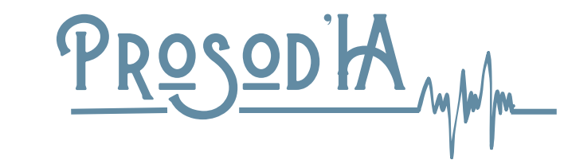
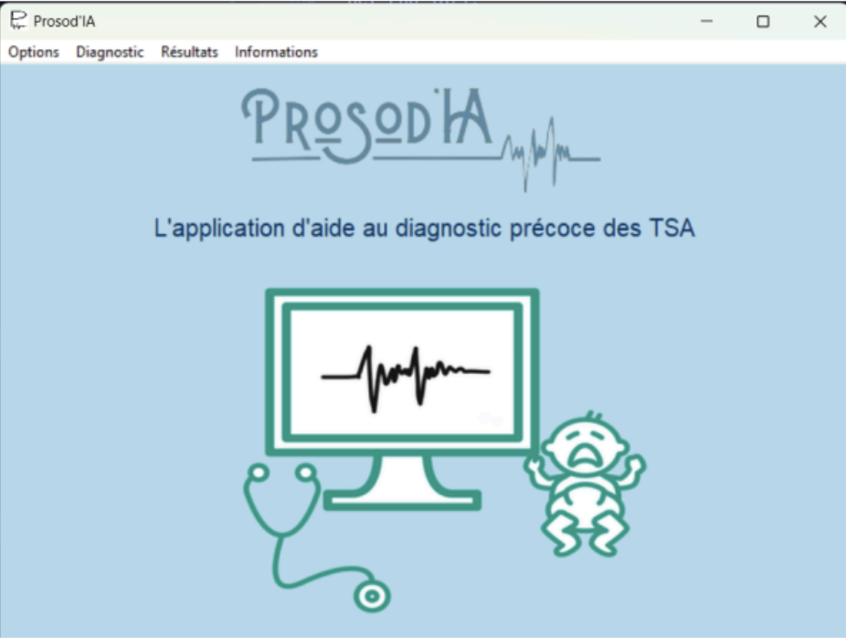
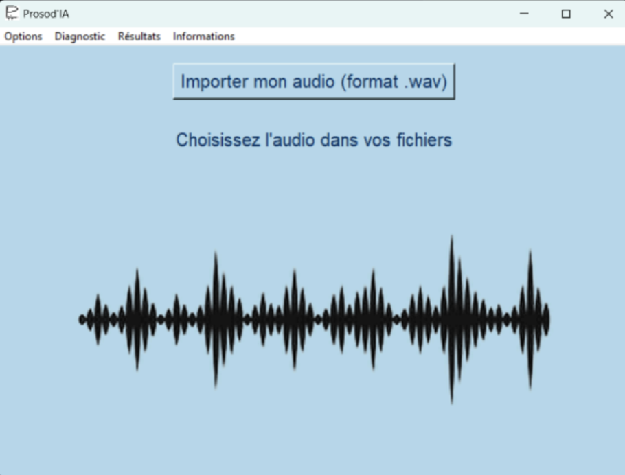
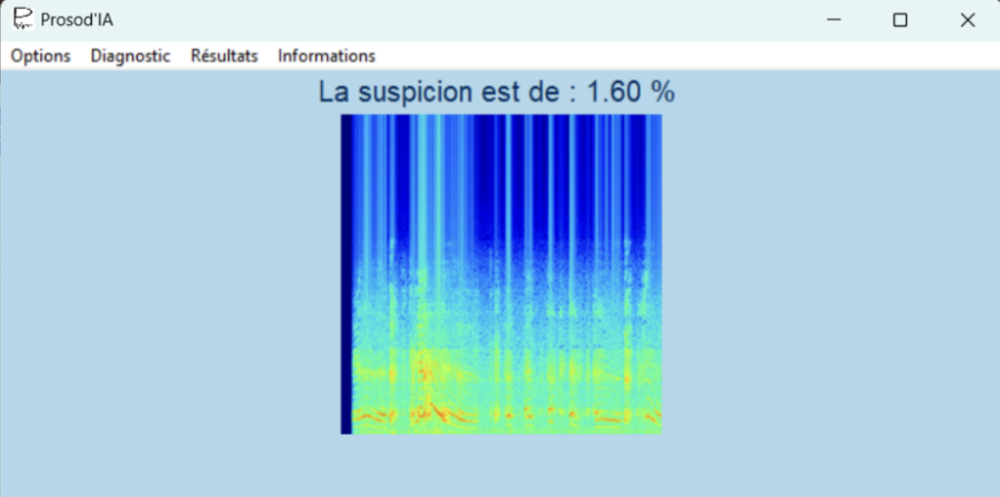

# 🏆 Prosod’IA – ESIEE Paris Innovation Award 2024  

    

    
    
    

 

<i>Projet académique de 3ᵉ année (Durée : 4 mois) – Lauréat du <b>Prix de l’Innovation 2024</b>, remis par Éric Larchevêque (Co-fondateur de Ledger).</i>

## 📑 Table des matières
- [Objectif](#-objectif)
- [Technologies utilisées](#-technologies-utilisées)
- [Méthodologie](#-méthodologie)
- [Résultats](#-résultats)
- [Aperçu de l’application](#-aperçu-de-lapplication)
- [Équipe](#-équipe)
- [Accès au code](#-accès-au-code)
- [Références](#-références)

## 🎯 Objectif  
Développer une application d’aide au **diagnostic précoce des Troubles du Spectre Autistique (TSA)**, basée sur l’analyse de la **prosodie** (caractéristiques vocales avant l’apparition du langage).  

➡️ Résultat principal : taux de fiabilité de **93%**.  
➡️ Nouvelle approche pour soutenir les professionnels de santé dans le dépistage des TSA, complémentaire aux méthodes actuelles.  

## 🔧 Technologies utilisées  
- **Traitement du signal** : Matlab, Python (Librosa, SciPy)  
- **IA & Deep Learning** : TensorFlow / Keras, Transfer Learning (VGG16, MobileNet, ResNet)  
- **Application** : Python (Tkinter) → exécutables Windows (.exe) et Mac (.app)  
- **Gestion de projet** : GitLab, Trello, diagrammes de Gantt  

## 🛠️ Méthodologie  
1. **Extraction des caractéristiques vocales** : MFCC, spectrogrammes, mel-spectrogrammes  
2. **Filtrage & prétraitement audio** : élimination des bruits parasites (Butterworth filter, segmentation)  
3. **Modélisation IA** : réseaux pré-entraînés et fine-tuning sur nos données  
4. **Développement logiciel** : application ergonomique pour médecins (diagnostic à partir d’un simple enregistrement)  

## 🚀 Résultats  
- Fiabilité : **93%** (contre ~86% sur travaux précédents à l’ESIEE)  
- Démonstration que des **marqueurs précoces** sont détectables dans la voix des enfants atteints de TSA  
- Déploiement sous forme d’application fonctionnelle (Windows et)  

## 📸 Aperçu de l’application

Déploiement : grâce à py2app et auto-py-to-exe (PyInstaller), l’application est disponible en exécutables autonomes (.exe Windows, .app Mac), sans installation Python requise, faciles à distribuer et à utiliser.

L’interface inclut un menu principal, une page d’import audio et une page de résultats avec spectrogramme.

    
      
    
    

## 📂 Accès au code  
👉 Le code source complet est disponible sur le **[GitLab de l’ESIEE Paris](https://git.esiee.fr/lalieut/prosod-ia)**.  
Ce repo GitHub sert de vitrine publique au projet.  

## 📜 Références  
- [Rapport complet du projet (PDF)](./docs/rapport.pdf)  
- [Affiche de présentation (PDF)](./docs/affiche.pdf) 
- [Vidéo de présentation (YouTube)](https://www.youtube.com/watch?v=wFQNDkl7yT4)

---

👤 Auteur : <a href="https://www.linkedin.com/in/nathan-lecoin-855940231/" target="_blank">Nathan Lecoin</a>

 

    <a href="#top">⬆️ Back to top</a>

